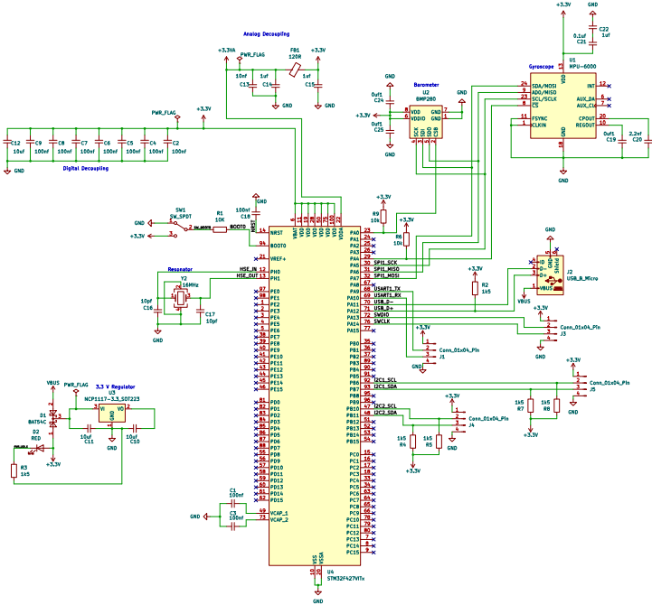

# Overview:
Self Built Drone Project including the following components
- STM32F427 based Flight Controller
- MPU-6000 (Gyro) providing accelormeter and gyroscopic data
- BMP280 (Barometer) for advanced altitude control 
- Crystal Resonator to filter out noise --> Required due to sensitive nature of analog components.
- Analog and Digital Decoupling
- Programmed via USB B

## Currently Working On:
- Sensor Fushion Algo to mesh together sensor data and estimate the drone’s orientation (roll, pitch, yaw) and position.

## Flight Controller Schematic (Updated Aug 23th):

