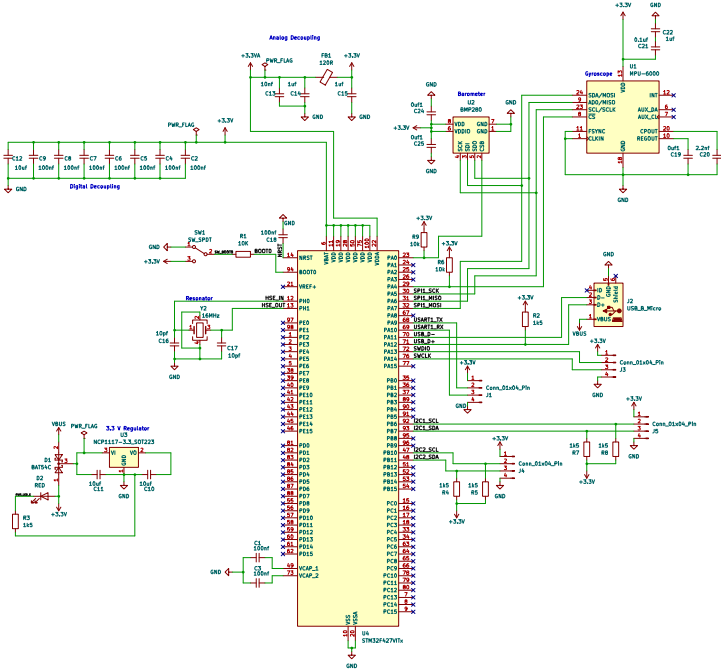
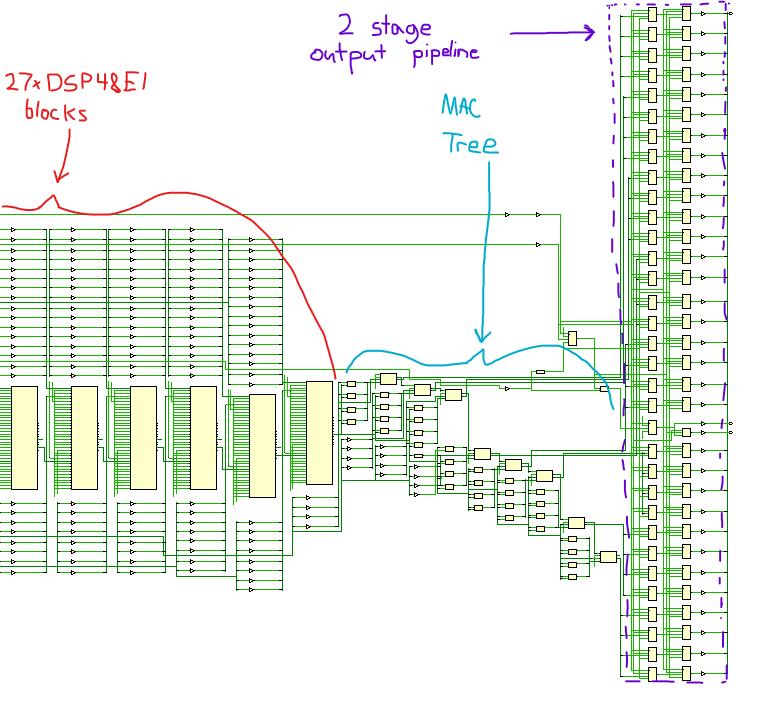
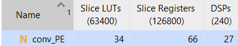

# Drone Flight Controller and FPGA EDGE-CNN Engine:
- Building FPGA + SoC compute for drones
- Currently working on a convolution processing block
- In this repo is attached a Literature overview on **operations in GNSS-denied environments** and the role of resilient, onboard inference for autonomous flight.

## Flight Controller:
- STM32F427 MCU
- MPU-6000 (Gyro) providing accelormeter and gyroscopic data
- BMP280 (Barometer) for advanced altitude control 
- Crystal Resonator to filter out noise --> Required due to sensitive nature of analog components.
- Analog and Digital Decoupling
- Programmed via USB B

### Schematic (Updated Aug 23th 2024):
 

# FPGA Edge-CNN Engine:

A lightweight, first-layer CNN accelerator aimed at **edge AI in aviation systems** (applicable to both defense and civilian use). The design focuses on the **compute backbone**—streaming pixels in, generating 3×3 windows, and executing a pipelined MAC—rather than model accuracy.

## Key Features:

* **Convolution:** 3×3 over RGB (3 input channels) → **8 output channels**
* **Precision:** 8-bit pixels, signed fixed-point weights/biases (Q format)
* **Throughput:** one window per cycle after fill; designed for 100 MHz on Artix-7
* **Memory:** statically inferred BRAM for weights/biases (loaded at config time)
* **Glue logic:** line buffers, sliding-window generator, and top-level orchestration

## Current Status:

* ✅ `conv_PE.sv` (core processing element) — **verified: see waveform and resource util below**
* 🟡 `window.sv` — **under test / fixes in progress**
* ⏳ `bram.sv`, `bus.sv`, `conv1_top.sv` — **queued for verification**

## Files & Modules:

* `conv_PE.sv` — 3×3×3 MAC with pipelined adder tree + bias
* `window.sv` — line buffers (per channel) + 3×3 sliding window
* `bram.sv` — weight/bias storage (inferred BRAM)
* `bus.sv` — simple weight/bias load & internal bus glue
* `conv1_top.sv` — integrates stream → window → PE(s) → stream out

### Waveforms:
#### Convolution Processing Block (conv_PE.sv):

