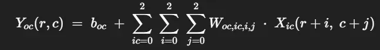
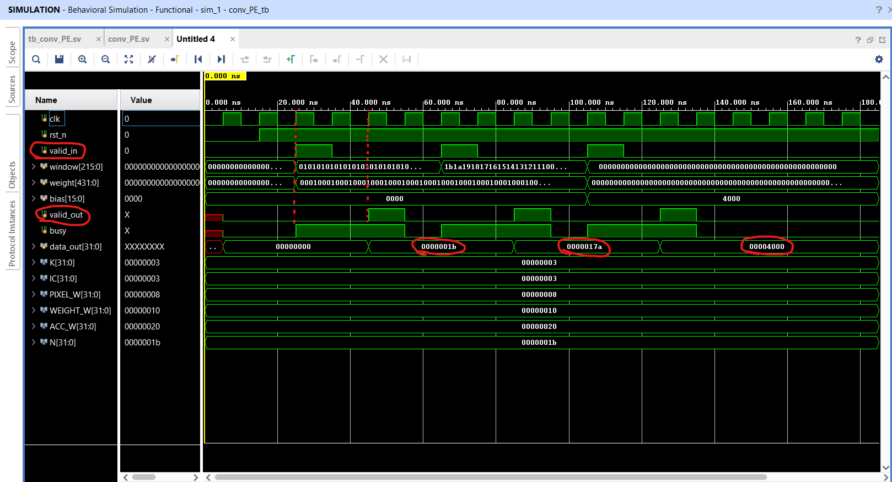

# Overview

- Simple bare bones convolution engine: first layer of a CNN, performing a 3×3 convolution over a 224×224 RGB image, producing 8 output feature maps.

# Specifications

## Functional Specifications

- **Convolution Formula**



- Yoc(r,c)=boc+ic=0∑2i=0∑2j=0∑2Woc,ic,i,j⋅Xic(r+i,c+j)
- OC (Output Channels) = 8
- IC (Input Channels) = 3 (R, G, B)
- B (Bias) per output channel
- W (Weights) per output channel, input channel, kernel position

- **Data Flow**
    1. **Input Pixel Streaming**
        - Interface: AXI4-Stream or custom handshake at 8 bits per channel
        - Pixel arrives one per clock, packaged as a 24-bit word (3 × 8-bit channels)
    2. **Channel Demultiplexing**
        - Split the 24-bit pixel into three parallel streams: R, G, B
        - Each channel stream feeds its own pixel pipeline
    3. **Line Buffers & Sliding Window**
        - Maintain K–1 = 2 line buffers per channel to store previous rows
        - Implemented using Block RAM (BRAM_18K) as dual-port FIFOs, depth = 224 pixels
        - For each channel, generate a 3×3 window of registers by shifting through LSB-first registers
    4. **MAC Array & Accumulation**
        - For each valid window, compute 9 multiplications per channel × 3 channels = 27 multipliers
        - Use DSP slices (Xilinx DSP48E cells) for each multiplier for high-speed fixed-point ops
        - Partial sums across window positions and channels accumulated via pipelined adder tree
    5. **Bias Addition & Output Streaming**
        - After accumulation, add per-channel bias (stored in BRAM or distributed registers)
        - Output 8 parallel results (one per output channel) serialized into a single stream via round-robin or time-multiplexing

## Data Structures

- **Weights & Biases Storage**
    - Stored in on-chip BRAM_18K blocks:
        - Depth = 3×3 (9 weights) × 3 input channels = 27 addresses per output channel
        - Width = data precision (e.g., 16-bit fixed-point)
    - Use one BRAM per output channel (total 8 BRAMs), each dual-ported for concurrent read/write
    - Address generator yields W_{oc,ic,i,j} indexed by ic,i,j; weights loaded at init via AXI-Lite or JTAG
- **Input Pixel FIFO**
    - Input pixel stream buffered in small FIFO (depth ≥ 4) implemented via distributed RAM or BRAM
    - Provides clock domain crossing if input camera pixel clock ≠ processing clock
- **Line Buffers (Per Channel)**
    - Implemented as depth-224 dual-port FIFOs in BRAM_18K
    - Two line buffers per channel to store last two rows of pixels
- **K×K Sliding Window Registers**
    - For each channel, cascade 3 shift-registers per row buffer to form a 3×3 window
    - Implemented via flip-flops (FFs) and LUTs, fully pipelined to supply one window per cycle
- **Channel Output FIFOs**
    - Each of the 8 output channels has an output buffer implemented via distributed RAM or BRAM
    - Buffers depth = to cover downstream handshake stalls, e.g., depth=16

## Technical Specifications

### Performance Parameters

- **Target Clock Frequency**: 100 MHz
- **Throughput**: One output pixel per cycle after pipeline fill
    - 100 million pixels/sec → For 224×224 frame (50 176 pixels), max ≈ 1 993 frames/sec
    - If valid padding (222×222 output), 49 284 pixels → ≈ 2 029 fps
- **Pipeline Latency**:
    - Line buffer fill latency = 2 rows = 2×224 = 448 cycles
    - Window register pipeline = ~2 cycles
    - MAC adder-tree depth = log₂(27) ≈ 5 pipeline stages
    - Total latency ≈ 448+2+5 ≈ 455 cycles before first valid output
- **Resource Utilization (Est.)**:
    - DSP48E: 27 (multipliers) + 8 (accumulate/bias) = 35 total
    - BRAM_18K: 8 (weights) + 3×2 (line buffers) + 8 (output FIFOs) = 22 blocks
    - LUT/FF: Sliding windows ~3×3×3 channels × 224 regs; additional logic

### Constraints

- **FPGA Resources**:
    - Xilinx Artix‑7 XC7A100T: 240 DSPs, 270 BRAM_18K, 63 400 LUTs, 126 800 FFs
    - Must keep DSP usage ≤ 80% (≤ 192 DSPs) for margin
    - BRAM usage ≤ 75% (≤ 202 blocks)
- **Timing**:
    - Meet setup/hold at 100 MHz across DSP and BRAM interfaces
    - Provide <10 ns hold margin for interconnect
- **Data Precision**:
    - Fixed-point Q2.14 (16-bit) to balance dynamic range vs resource usage
- **Power/Area**:
    - Estimated dynamic power ≤ 2 W for MAC unit at 100 MHz
- **Interface Protocols**:
    - Input: AXI4-Stream (TVALID/TREADY handshake)
    - Control: AXI-Lite for register configuration (weights, biases, frame size)
- **Scalability**:
    - Design must support parameterizable kernel size (K), channels, and feature map counts via generics

## Additional Specification Analysis

# Dev Log

# Specification Analysis:

[GPT Prompt](https://www.notion.so/GPT-Prompt-239d247691ed8081a1c1c3fbf6112dc7?pvs=21)

### Qm.n Data Format for Conv Engine

| Signal | Format | Bit‐width | Range | Notes |
| --- | --- | --- | --- | --- |
| **Pixels** | unsigned Q8.0 | 8-bits | [0, 255] | Splitting into R, G, B doesn’t change this—you still treat each as 8-bit unsigned. |
| **Weights / Bias** | signed Q1.15 | 16-bits | [–2.0, +1.99997] | **Pros:** very fine fractional resolution (≈3×10⁻⁵), ideal for small weights. **Cons:** tiny integer range—if any trained weight/bias exceeds ±2 you’ll saturate. You may need Q2.14 or Q3.13 if your model has larger-magnitude filters. |
| **DSP product** | Q9.15 | 24-bits | sign + 9 integer bits + 15 fraction bits | 8-bit Q8.0 × 16-bit Q1.15 ⇒ 9 integer bits, 15 frac → 24 bits total (including sign). |
| **Accumulator** | signed Q14.15* | 29 bits† | sign + 13 integer bits + 15 fraction bits | Summing 27 products: worst case ~27 × 255 ≈ 6 885 → needs 13 integer bits. You’ve budgeted 32 bits, so you get 3 guard bits—good safety margin for headroom and rounding. |

### Pipeline stage breakdown & latency of a single Conv Unit

If you register between each major step of this MAC, your pipeline depth (latency) is roughly:

1. **DSP multiply** → 1 cycle (27 DSPs)
2. **Adder tree** → 5 pipeline registers (one per level)
3. **Bias add** → 1 cycle
4. **Final output register** → 1 cycle

> Total latency ≃ 1 + 5 + 1 + 1 = 8 cycles from when the 3×3 window pixels enter the MAC until Y(r,c) appears.
> 
- Because it’s fully pipelined, once filled you get one (or one group of) result every cycle.
- for now —> a single pipeline register per stage is acceptable, but we may need to increase this

**Multi Engine Scheduling of MAC:**

- we gonna run 4 conv engines in parallel and toggle this with a state bit

**Adder Tree Depth**

- 27 products to sum together per output channel
- For 27 inputs you need 5 levels (27→14→7→4→2→1).

### Calculating latency & throughput

- **Latency** (first Y appears) = pipeline_depth = ~8 cycles.
- **Throughput** (engines = E, OC = 8):
    - You issue one new window every cycle → that window is tagged with a channel-group ID (0…⌈OC/E⌉–1).
    - Each engine produces E outputs per cycle → you finish all OC outputs in ⌈OC/E⌉ cycles.
    - **E=4 → ⌈8/4⌉=2 cycles** per pixel to get its full 8-channel vector.

### Additional Notes:

- weights and biases hard coded in rtl

# Symbol Creation

```verilog
                         ┌────────────────────────────────────┐
    clk ────────────────▶│                                    │
    rst_n ──────────────▶│                                    │
                         │          conv_engine               │
 pixel_valid ──────────▶│                                    │
 pixel_ready ◀─────────┤                                    │
   pixel_in[23:0] ─────▶│       (R,G,B packed as 3×8-bit)   │
                        │                                    │
     conv_valid ◀───────┤                                    │
     conv_ready ───────▶│                                    │
  conv_data_out[127:0]─▶│   (4 × 32-bit Q14.15 outputs)      │
                        └────────────────────────────────────┘
```

Handshake b/w sink (consumer) and source (producer)

- valid - source
- ready - sink

```verilog
module conv_engine #(
  parameter PIXEL_WIDTH   = 8,
  parameter IC            = 3,
  parameter OC            = 8,
  parameter K             = 3,
  parameter WEIGHT_WIDTH  = 16,
  parameter ACC_WIDTH     = 32,
  parameter FRAC_BITS     = 15,
  parameter PARALLEL      = 4       // engines per pixel
)(
  input  wire                     clk,
  input  wire                     rst_n,

  // input pixel stream
  input  wire                     pixel_valid, // producer ready to send into our module
  output wire                     pixel_ready, // conv ready to consume
  input  wire [IC*PIXEL_WIDTH-1:0] pixel_in, // 24 bits (r, g, b)

  // conv outputs (4 channels per cycle)
  output wire                     conv_valid, // output ready
  input  wire                     conv_ready, // downstream ready to recieve
  output wire [PARALLEL*ACC_WIDTH-1:0] conv_data_out // 128 bit output bus for the current weight batch
);
  // … internal instantiations go here …
endmodule

```

```verilog
                              ┌──────────────┐
                              │  state FSM   │◀─(toggles 0↔1 each pixel)
                              └──────────────┘
                                       │
                                       ▼
┌───────────┐     ┌───────────────┐    ┌─────────────────────────────┐
│ pixel_in  │────▶ demux to R,G,B ──▶│ line buffers                 │
│ [23:0]    │     └───────────────┘    │ (2 rows each)x 3 channels   │
└───────────┘                          └─────────────────────────────┘
                                            │
                                            ▼
                                  ┌────────────────────┐
                                  │ window_gen × 3     │  
                                  │ (3×3 window per    │
                                  │   channel)         │
                                  └────────────────────┘
                                            │
                                            ▼
                                  ┌────────────────────┐
                                  │ weight/bias ROM    │
                                  │  (8×27 weights +   │
                                  │   8×bias)          │
                                  └────────────────────┘
                                            │
                                            ▼
                          ┌───────────────────────────────┐
                          │ 4× conv_PE instances (DSPs)   │
                          │  • 27 multiplies (3×3×3)      │
                          │  • adder tree → sum           │
                          │  • + bias                      │
                          │  • ReLU (0 if sum<0)          │
                          └───────────────────────────────┘
                                            │
                                            ▼
                                  ┌────────────────────┐
                                  │ output registers   │
                                  │ pack 4×32-bit words│
                                  └────────────────────┘
                                            │
                                            ▼
                                  conv_data_out[127:0]
                                      conv_valid

```


